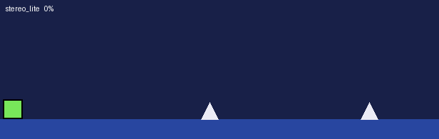
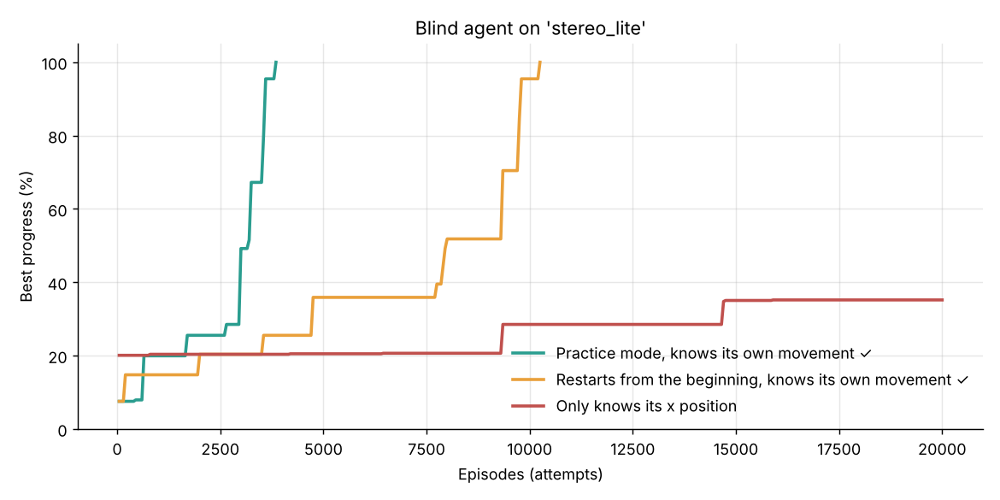

# Geometry Dash AI — Step 0: mini simulator + blind agent

🇬🇧 [English](#english) · 🇫🇷 [Français](#français)



---

## English

Before hooking up the real game, the idea is validated on a **simplified Python copy of GD** (cube mode only).
The agent is **blind**: it sees no obstacle at all and learns by trial and error
("here, jumping killed me / didn't kill me").

### Installation

```
pip install -r requirements.txt
```

### Files

| File | Purpose |
|---|---|
| `gdsim.py` | Cube physics (240 Hz, deterministic) and training environment (Gymnasium-like API) |
| `levels.py` | Levels drawn in ASCII (`^` spike, `#` block). Add your own here |
| `search_bot.py` | Non-AI backtracking bot: proves a level is beatable, used as a reference |
| `train_qlearning.py` | The blind agent (Q-learning), with or without practice mode |
| `render.py` | Turns a solution into a GIF |
| `compare.py` | Compares every variant over 5 seeds |
| `plot_curves.py` | Plots the learning curves |
| `realenv.py` | Same environment API, but for the real game through the mod |
| `test_bridge.py` | Checks the connection with the real game |
| `test_practice.py` | Checks practice mode (checkpoints) on the real game |
| `diag_bridge.py` | Step-by-step trace of the start of an attempt (debugging) |
| `mod/` | The Geode mod (C++) |

### Commands

```
python train_qlearning.py                     # blind agent, practice mode, stereo_lite level
python train_qlearning.py --mode normal       # always restarts from the beginning
python train_qlearning.py --obs x             # only knows its x position
python render.py solution_qlearning_stereo_lite_practice_state.txt
python compare.py
python plot_curves.py
```

### First results (`stereo_lite` level, 5 seeds)

| Variant | Success | Steps simulated (median) | Real-time equivalent |
|---|---|---|---|
| Search bot (reference) | yes | 1,456 | < 1 min |
| Blind agent, practice mode | 5/5 | ~285,000 | ~1 h 20 |
| Blind agent, restarts from the beginning | 5/5 | ~1,490,000 | ~7 h |
| Agent that only knows x | 0/5 | — | — |



Takeaways:
1. **The blind agent works**, as long as it knows its own movement (height, vertical speed, grounded or not).
   With x alone, it mixes up different situations (in the air / on the ground) and fails.
2. **Practice mode cuts training time by ~5x.** Keep it for the real game.
3. **A speedhack will be essential**: in real time, even a very easy level would take hours.
4. A simple search bot is hundreds of times more efficient on this problem. RL becomes worthwhile
   in phase 2 (an agent that sees the level and must generalize to unseen levels).

### Connecting the real game (Geode mod)

The `mod/` folder contains **GD AI Bridge**, a Geode mod (GD 2.2081, Geode 5.10, Windows) that opens a local
server on `127.0.0.1:22222`. Python drives the game in **lockstep**: the game only advances when the agent
asks for a step, each step is exactly 1/60 s of game time, and many steps run per rendered frame (speedhack).
When nothing is connected, the game behaves normally.

**1. Build the mod** — easiest: push the repo, then on GitHub open *Actions → Build Geode mod*, open the
latest run and download the `gd-ai-bridge` artifact (a zip containing a `.geode` file).
Local alternative: install the Geode CLI, Visual Studio Build Tools (C++) and CMake, run
`geode sdk install` and `geode sdk install-binaries` once, then `geode build` inside `mod/`.

**2. Install it** — copy the `.geode` file into `geode/mods/` in the GD folder
(Steam: right-click GD → Manage → Browse local files), then restart GD.

**3. Test the connection** — open a level (Stereo Madness), then:
```
python test_bridge.py
```
It checks running, jumping, determinism and speed. While Python is connected but idle, the game freezes: that is expected.

**4. Check practice mode (GD checkpoints)** — `python test_practice.py` checks that respawning at a
checkpoint reproduces the original run exactly, and that GD's automatic checkpoints are ignored.

**5. Train on the real game**
```
python train_qlearning.py --env real                 # practice mode (GD checkpoints)
python train_qlearning.py --env real --mode normal   # always from the start
python train_qlearning.py --env real --resume        # continue (Ctrl+C saves everything)
```
Checkpoints are only placed on the ground along the best run so far, and moved back if the agent
makes no progress from them for 300 attempts (protection against "impossible" checkpoints).

### Next steps

- Add the ship (hold the button) to the simulator.
- Phase 2: an agent that sees the obstacles.

---

## Français

Avant de brancher le vrai jeu, on valide l'idée sur une **copie simplifiée de GD en Python** (mode cube uniquement).
L'IA est **aveugle** : elle ne voit aucun obstacle et apprend par essai-erreur
(« à cet endroit, sauter m'a tué / ne m'a pas tué »).

### Installation

```
pip install -r requirements.txt
```

### Fichiers

| Fichier | Rôle |
|---|---|
| `gdsim.py` | Physique du cube (240 Hz, déterministe) et environnement d'entraînement (API style Gymnasium) |
| `levels.py` | Les niveaux, dessinés en ASCII (`^` pic, `#` bloc). Ajoute les tiens ici |
| `search_bot.py` | Bot sans IA par retour arrière : prouve qu'un niveau est faisable, sert de référence |
| `train_qlearning.py` | L'IA aveugle (Q-learning), avec ou sans mode practice |
| `render.py` | Transforme une solution en GIF |
| `compare.py` | Compare toutes les variantes sur 5 graines |
| `plot_curves.py` | Trace les courbes d'apprentissage |
| `realenv.py` | Même API d'environnement, mais pour le vrai jeu via le mod |
| `test_bridge.py` | Vérifie la connexion avec le vrai jeu |
| `test_practice.py` | Vérifie le mode practice (checkpoints) sur le vrai jeu |
| `diag_bridge.py` | Trace pas à pas du début d'une tentative (débogage) |
| `mod/` | Le mod Geode (C++) |

### Commandes

```
python train_qlearning.py                     # IA aveugle, mode practice, niveau stereo_lite
python train_qlearning.py --mode normal       # recommence toujours du début
python train_qlearning.py --obs x             # ne connaît que sa position x
python render.py solution_qlearning_stereo_lite_practice_state.txt
python compare.py
python plot_curves.py
```

### Premiers résultats (niveau `stereo_lite`, 5 graines)

| Variante | Réussite | Pas simulés (médiane) | Équivalent en temps réel |
|---|---|---|---|
| Bot recherche (référence) | oui | 1 456 | < 1 min |
| IA aveugle, mode practice | 5/5 | ~285 000 | ~1 h 20 |
| IA aveugle, recommence du début | 5/5 | ~1 490 000 | ~7 h |
| IA ne connaissant que x | 0/5 | — | — |

Ce qu'on en retire :
1. **L'IA aveugle marche**, à condition qu'elle connaisse son propre mouvement (hauteur, vitesse, au sol ou non).
   Avec seulement x, elle mélange des situations différentes (en l'air / au sol) et n'y arrive pas.
2. **Le mode practice divise le temps par ~5.** À garder pour le vrai jeu.
3. **Le speedhack sera indispensable** : en temps réel, il faudrait des heures même pour un niveau très facile.
4. Un simple bot de recherche est des centaines de fois plus efficace sur ce problème. Le RL deviendra
   intéressant en phase 2 (une IA qui voit le niveau et doit généraliser à des niveaux inconnus).

### Brancher le vrai jeu (mod Geode)

Le dossier `mod/` contient **GD AI Bridge**, un mod Geode (GD 2.2081, Geode 5.10, Windows) qui ouvre un serveur
local sur `127.0.0.1:22222`. Python pilote le jeu **pas à pas** : le jeu n'avance que quand l'IA demande un pas,
chaque pas dure exactement 1/60 s de jeu, et plusieurs pas sont joués par image affichée (speedhack).
Sans connexion, le jeu fonctionne normalement.

**1. Compiler le mod** — le plus simple : pousser le dépôt, puis sur GitHub ouvrir *Actions → Build Geode mod*,
ouvrir la dernière exécution et télécharger l'artefact `gd-ai-bridge` (un zip qui contient un fichier `.geode`).
Alternative en local : installer le Geode CLI, Visual Studio Build Tools (C++) et CMake, lancer une fois
`geode sdk install` et `geode sdk install-binaries`, puis `geode build` dans `mod/`.

**2. L'installer** — copier le fichier `.geode` dans `geode/mods/` du dossier de GD
(Steam : clic droit sur GD → Gérer → Parcourir les fichiers locaux), puis relancer GD.

**3. Tester la connexion** — ouvrir un niveau (Stereo Madness), puis :
```
python test_bridge.py
```
Le script vérifie la course, le saut, le déterminisme et la vitesse. Quand Python est connecté mais ne fait rien, le jeu se fige : c'est normal.

**4. Vérifier le mode practice (checkpoints de GD)** — `python test_practice.py` vérifie que repartir
d'un checkpoint reproduit exactement la partie d'origine, et que les checkpoints automatiques de GD sont ignorés.

**5. Entraîner sur le vrai jeu**
```
python train_qlearning.py --env real                 # mode practice (checkpoints de GD)
python train_qlearning.py --env real --mode normal   # toujours depuis le début
python train_qlearning.py --env real --resume        # reprendre (Ctrl+C sauvegarde tout)
```
Les checkpoints ne sont posés qu'au sol, le long de la meilleure partie, et reculés si l'IA ne progresse
pas pendant 300 essais (protection contre les checkpoints « impossibles »).

### Suite

- Ajouter le vaisseau (maintenir la touche) dans le simulateur.
- Phase 2 : une IA qui voit les obstacles.
