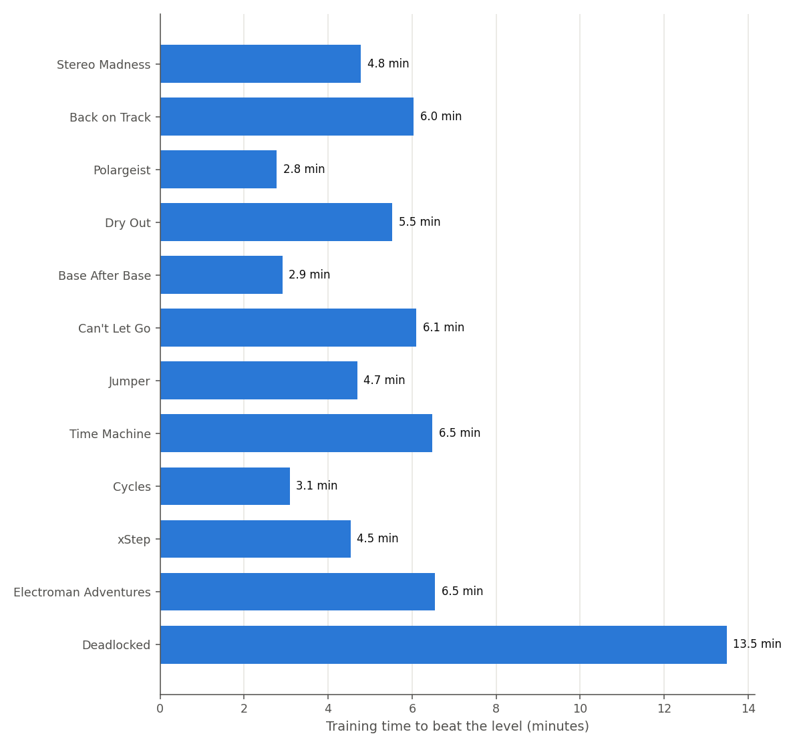
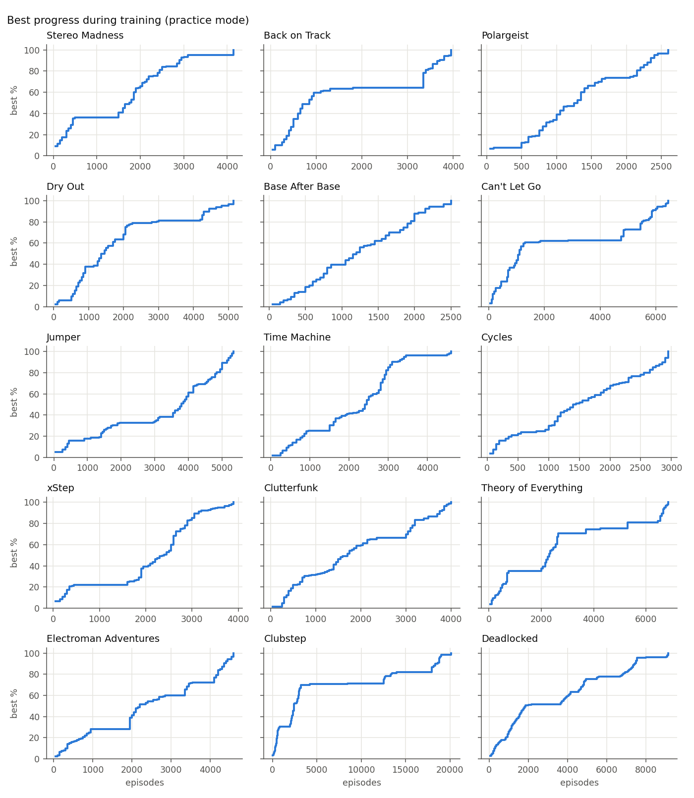
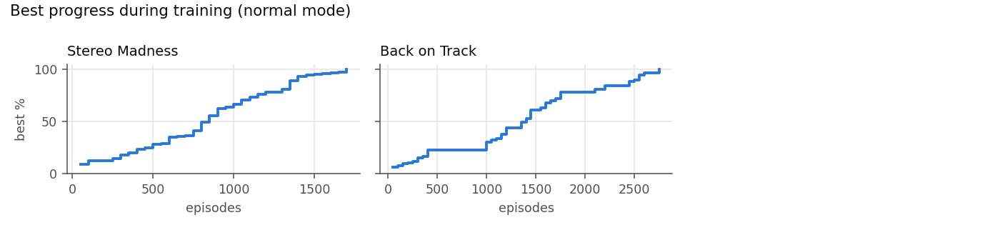
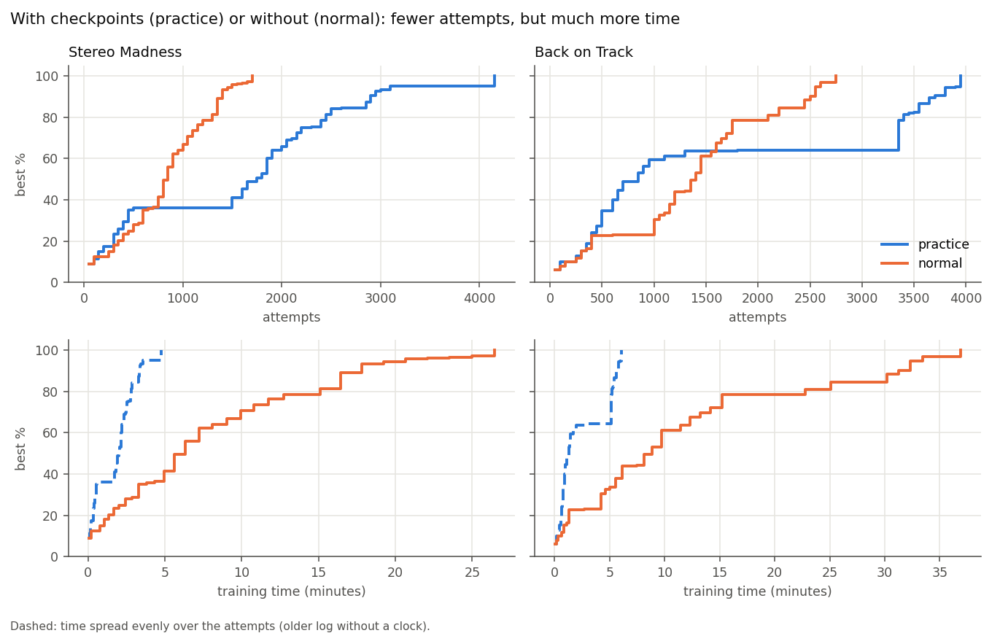
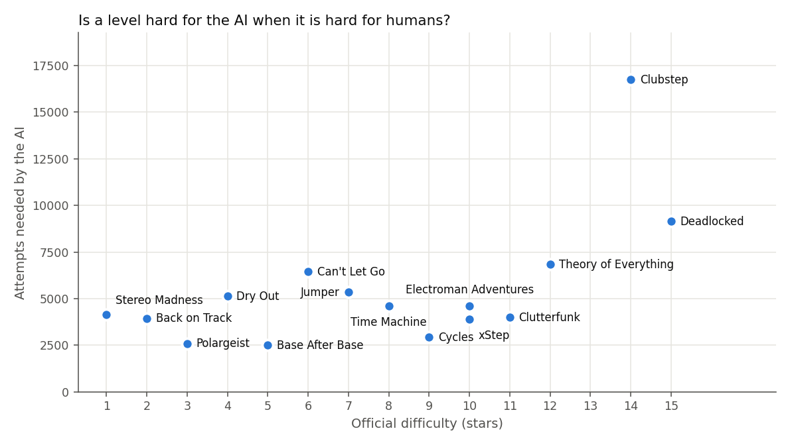

# Results / Résultats

🇬🇧 [English](#english) · 🇫🇷 [Français](#français)

## English

### How the numbers are measured

- **Agent**: blind tabular Q-learning (it never sees obstacles, only its own position, height, vertical speed and whether it is on the ground), with focused exploration, held exploratory actions and reverse replay of each attempt. Details: `notes/` guide and the main README.
- **Game**: the real Geometry Dash 2.2081 through the GD AI Bridge mod, deterministic lockstep, about 35× real time.
- **One run** = training from an empty Q-table until the level is beaten (or a time limit). Each level is learned from scratch: nothing is transferred between levels.
- **Practice mode** = attempts restart from GD checkpoints placed just before the hardest part; **normal mode** = every attempt restarts from the beginning.
- *Episodes* = attempts; *steps played* = decisions sent to the game (1 step = 1/60 s of game time); *time* = wall-clock training time on one PC.

### Caveats

- Stereo Madness was the development level: the settings changed many times during its training, so its numbers are not comparable. A clean run is planned.
- Time Machine was interrupted once (a checkpoint the game could not reproduce) and then resumed: episodes are summed, total time is unknown.
- One run per level and configuration: the times vary from one run to another, so small differences between levels are not meaningful.

## Français

### Comment les chiffres sont mesurés

- **IA** : Q-learning tabulaire « aveugle » (elle ne voit jamais les obstacles, seulement sa position, sa hauteur, sa vitesse verticale et si elle touche le sol), avec exploration ciblée, appuis maintenus et rejeu à l'envers de chaque essai. Détails : le guide dans `notes/` et le README.
- **Jeu** : le vrai Geometry Dash 2.2081 via le mod GD AI Bridge, pas à pas et déterministe, environ 35 fois le temps réel.
- **Une course** = entraînement depuis une table vide jusqu'à finir le niveau (ou une limite de temps). Chaque niveau est appris de zéro : rien n'est transféré d'un niveau à l'autre.
- **Mode practice** = les essais repartent de checkpoints de GD posés juste avant la difficulté ; **mode normal** = chaque essai repart du début.
- *Épisodes* = essais ; *pas joués* = décisions envoyées au jeu (1 pas = 1/60 s de jeu) ; *temps* = durée réelle d'entraînement sur un PC.

### Limites

- Stereo Madness était le niveau de développement : les réglages ont changé plusieurs fois pendant son entraînement, ses chiffres ne sont donc pas comparables. Une course propre est prévue.
- Time Machine a été interrompu une fois (un checkpoint que le jeu ne savait pas reproduire), puis repris : les épisodes sont additionnés, le temps total est inconnu.
- Une seule course par niveau et par configuration : les temps varient d'une course à l'autre, donc de petits écarts entre niveaux ne veulent rien dire.

## Data / Données

Generated by `python make_report.py` from the logs in `results/` (raw data: `results/summary.csv`).
Généré par `python make_report.py` à partir des logs de `results/` (données brutes : `results/summary.csv`).

<!-- results:start (generated by make_report.py, do not edit by hand) -->

| Level | Mode | Variant | Result | Episodes | Steps played | Time | Notes |
|---|---|---|---|---|---|---|---|
| Stereo Madness | normal | default | beaten | 1,700 | 4,725,763 | 26.4 min |  |
| Stereo Madness | practice | default | beaten | 4,150 | 749,552 | 4.8 min |  |
| Back on Track | normal | default | beaten | 2,750 | 6,873,904 | 36.9 min |  |
| Back on Track | practice | default | beaten | 3,950 | 1,062,140 | 6.0 min |  |
| Polargeist | practice | default | beaten | 2,600 | 457,379 | 2.8 min |  |
| Dry Out | practice | default | beaten | 5,150 | 848,323 | 5.5 min |  |
| Base After Base | practice | default | beaten | 2,500 | 486,299 | 2.9 min |  |
| Can't Let Go | practice | default | beaten | 6,450 | 906,805 | 6.1 min |  |
| Jumper | practice | default | beaten | 5,350 | 779,569 | 4.7 min |  |
| Time Machine | practice | default | beaten | 4,600 | 1,029,418 | 6.5 min |  |
| Cycles | practice | default | beaten | 2,950 | 525,806 | 3.1 min |  |
| xStep | practice | default | beaten | 3,900 | 762,972 | 4.5 min |  |
| Clutterfunk | practice | default | beaten | 4,000 | 800,529 | 5.0 min |  |
| Theory of Everything | practice | default | beaten | 6,850 | 1,112,616 | 7.5 min | 2 checkpoint(s) set aside |
| Electroman Adventures | practice | default | beaten | 4,600 | 1,150,451 | 6.5 min |  |
| Clubstep | practice | default | beaten | 16,750 | 2,830,820 | 22.7 min | finer state (--obs fine) |
| Hexagon Force | practice | default | beaten | 6,850 | 1,391,029 | 10.1 min |  |
| Deadlocked | practice | default | beaten | 9,150 | 2,065,893 | 13.5 min | finer state (--obs fine) |

### Difficulty according to the AI / Difficulté selon l'IA

Levels ranked by the number of attempts (practice mode) the agent needed to beat them. "Hardest passage": the longest time it went without beating its record, and where.

| Rank | Level | Official stars | Attempts to beat it | Hardest passage |
|---|---|---|---|---|
| 1 | Clubstep | 14 | 16,750 | stuck 1,300 attempts at 83% |
| 2 | Deadlocked | 15 | 9,150 | stuck 1,500 attempts at 52% |
| 3 | Theory of Everything | 12 | 6,850 | stuck 1,150 attempts at 81% |
| 4 | Hexagon Force | 12 | 6,850 | stuck 1,050 attempts at 94% |
| 5 | Can't Let Go | 6 | 6,450 | stuck 1,850 attempts at 62% |
| 6 | Jumper | 7 | 5,350 | stuck 1,000 attempts at 33% |
| 7 | Dry Out | 4 | 5,150 | stuck 700 attempts at 81% |
| 8 | Time Machine | 8 | 4,600 | stuck 550 attempts at 25% |
| 9 | Electroman Adventures | 10 | 4,600 | stuck 1,000 attempts at 28% |
| 10 | Stereo Madness | 1 | 4,150 | stuck 1,050 attempts at 95% |
| 11 | Clutterfunk | 11 | 4,000 | stuck 650 attempts at 66% |
| 12 | Back on Track | 2 | 3,950 | stuck 1,550 attempts at 64% |
| 13 | xStep | 10 | 3,900 | stuck 650 attempts at 22% |
| 14 | Cycles | 9 | 2,950 | stuck 200 attempts at 24% |
| 15 | Polargeist | 3 | 2,600 | stuck 250 attempts at 74% |
| 16 | Base After Base | 5 | 2,500 | stuck 200 attempts at 40% |

Agreement with the official difficulty (Spearman rank correlation, 1 = same order, 0 = unrelated): **0.60** over 16 levels.

<!-- results:end -->
